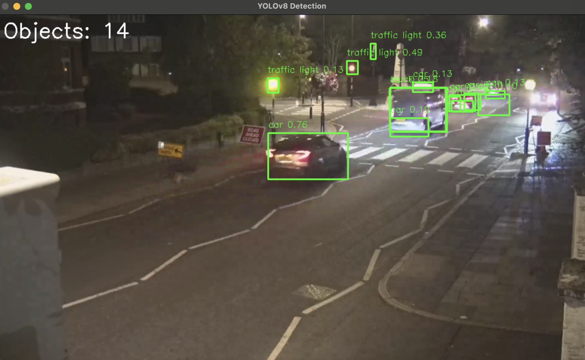
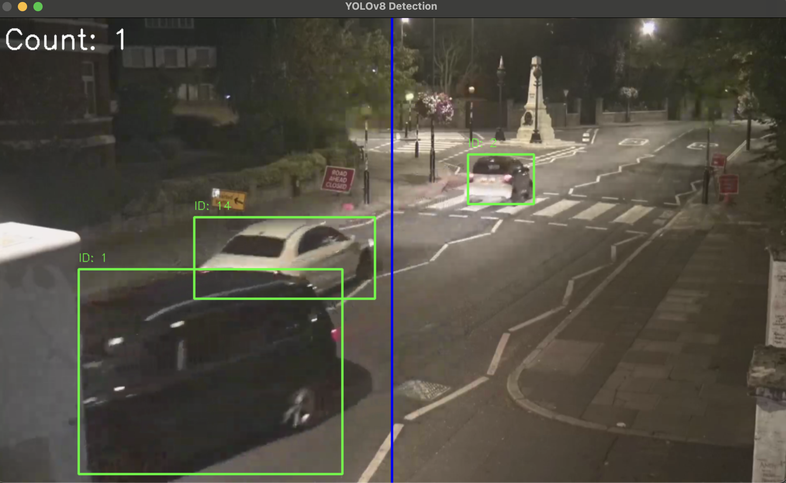

# YOLOv8 Video Object Counter (YouTube/Local)

Counts moving objects that cross a vertical line in a video stream.
Built with Ultralytics YOLOv8 tracking + OpenCV for drawing, and VidGear (CamGear) to pull a YouTube stream.

|  Press ESC to quit. Adjust the counting line with line_x in the script.

## What it does

- Loads a YOLOv8 model and tracks objects frame-to-frame (model.track(..., persist=True)).
- Assigns each object a track ID, draws boxes + IDs, and counts when the object’s center crosses a vertical line.
- Works with YouTube sources via CamGear or a local file.
- Shows a running Count overlay.

## Screenshots

#### main.py, counts and labels the objects


#### trackerStream, tracks the number of objects crossing the blue line


## Project Files

1. main.py - counts the number of objects from a default YouTube video
2. camera.py - counts the number of objects from camera feed
3. trackerStream.py — counts the number of objects that cross the horizontal line left to right from a default YouTube stream
4. trackerCamera.py - counts the number of objects that cross the horiztontal line left to right from camera feed

## Recommended Environment

YOLO + Torch wheels are sensitive to Python version. Use Python 3.11 for best results.

### macOS (Apple Silicon / M-series)
Python 3.11, Homebrew, FFmpeg

Torch will use MPS (Apple GPU) automatically

### Windows / Linux
Python 3.11, FFmpeg on PATH

Different Python versions (e.g., 3.13) can cause libtorch_cpu.dylib / dlopen errors. Pin to 3.11.

## Setup

### macOS (Apple Silicon)

1) Tools
```
brew install python@3.11 ffmpeg
```

2) Create and activate a 3.11 venv
```
/opt/homebrew/bin/python3.11 -m venv venv
source venv/bin/activate
```

3) Upgrade pip tooling
```
python -m pip install --upgrade pip setuptools wheel
```

4) Install compatible packages
```
pip install "torch==2.3.1" "torchvision==0.18.1"           # macOS arm64 wheel with MPS
pip install "ultralytics==8.3.0" "opencv-python==4.9.0.80"
pip install "vidgear[core]==0.3.2" "yt-dlp==2024.08.06"
```

### Windows / Linux
1) Python 3.11 + FFmpeg
```
Windows: install Python 3.11 from python.org
Windows: choco install ffmpeg   OR download and add ffmpeg to PATH
Linux:   sudo apt-get install ffmpeg
```

2) Create venv
```
py -3.11 -m venv venv # Windows
python3.11 -m venv venv # Linux
```

3) Activate
```
venv\Scripts\activate        # Windows
source venv/bin/activate     # Linux
```

4) Install deps
```
python -m pip install --upgrade pip setuptools wheel
pip install "torch==2.3.1" "torchvision==0.18.1"
pip install "ultralytics==8.3.0" "opencv-python==4.9.0.80"
pip install "vidgear[core]==0.3.2" "yt-dlp==2024.08.06"
```

## Run
```
source venv/bin/activate          # or venv\Scripts\activate on Windows
python main.py/camera.py/trackerStream.py/trackerCamera.py
```

Default source is a YouTube URL (in the script).

ESC to exit the window.

## Configure

Open .py files and adjust:

model = YOLO('yolov8l.pt')     # try 'yolov8n.pt' for faster/smaller model

line_x = 510                   # vertical counting line (pixels from left)

results = model.track(frame, persist=True, conf=0.10)[0]  # change conf threshold

frame = cv2.resize(frame, (1020, 600))  # change output size

## How counting works

For each tracked object, it computes the center X of its bounding box each frame.

If its previous center was left of line_x and the current is right (or vice versa), the counter updates.

Track IDs come from Ultralytics’ tracker (persisted between frames).

## Modules Used

Ultralytics YOLOv8

OpenCV

VidGear (CamGear)

yt-dlp